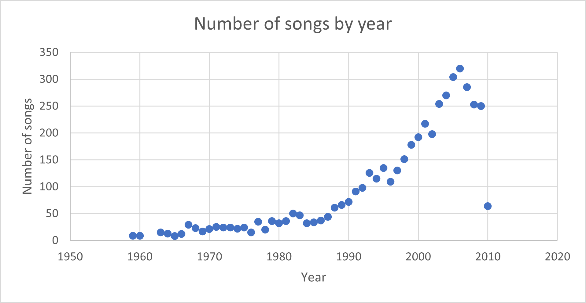

# BDA Projet

**Étudiants :** Antony Carrard, Anne Sophie Ganguillet, Dalia Maillefer, Killian Vervelle

**Date :** 9 juin 2023

**Cours :** Big Data Analytics

## Sujet: Recommandation de musique à partir du dataset the `Million Song Dataset`

### Contexte
Les moteurs de recommandation, dès bien présents sur internet, tels que ceux d’Amazon ou de Spotify, sont reconnus pour leur performance, mais surtout leur accessibilité et leur intuitivité d’utilisation. Le projet s’inscrit dans cette tendance et conduira au développement d’un moteur de recommandation de musiques basé sur des méthodes statistiques, Scala et MLlibs. 

### Téléchargement du dataset

Le dataset est disponible dans les liens ci-dessous.

Le dataset en entier : http://millionsongdataset.com/pages/getting-dataset/

Le sub dataset : http://labrosa.ee.columbia.edu/~dpwe/tmp/millionsongsubset.tar.gz

Pour convertir les fichiers .h5 en .parquet, il suffit de lancer le script `main.py` sous le commentaire `DATA AUGMENTATION - ANALYTICS`

### Description du dataset
Pour commencer, nous sommes partis d'un dataset publié par Audioscrobbler, le moteur de recommandation de last.fm, l’un des principaux sites de radio. D’après leur README, le dataset serait en continuelle augmentation. Cependant, nous n’avons accès qu’à une version antérieure, datant du 6 mai 2005, et très limitée en termes de catégories de données. Ainsi, nous avons décidé de partir sur un autre dataset opensource, dénommé "the Million Song Dataset". Le dataset est constitué d'un million d'échantillons d'analyses de chansons, ce qui représente une taille totale de 280 Go. Le jeu de données contient les catégories suivantes :

```
| Field Name               | Type       | Description                              |
|--------------------------|------------|------------------------------------------|
| artist hotttnesss        | float      | algorithmic estimation                   |
| artist id                | string     | Echo Nest ID                             |
| artist latitude          | float      | latitude                                 |
| artist location          | string     | location name                            |
| artist longitude         | float      | longitude                                |
| artist name              | string     | artist name                              |
| beats confidence         | array float| confidence measure                       |
| beats start              | array float| result of beat tracking                  |
| duration                 | float      | in seconds                               |
| energy                   | float      | energy from listener point of view       |
| key                      | int        | key the song is in                       |
| key confidence           | float      | confidence measure                       |
| loudness                 | float      | overall loudness in dB                   |
| mode                     | int        | major or minor                           |
| mode confidence          | float      | confidence measure                       |
| release                  | string     | album name                               |
| similar artists          | array str  | Echo Nest artist IDs (sim. unpublished)  |
| song hotttnesss          | float      | algorithmic estimation                   |
| tempo                    | float      | estimated tempo in BPM                   |
| time signature           | int        | estimate of number of beats per bar      |
| time signature confidence| float      | confidence measure                       |
| title                    | string     | song title                               |
| year                     | int        | song release year from MusicBrainz or 0  |

```

Nos modèles seront entrainés sur un échantillon de 10 000 chansons. Les données seront récupérées depuis un échantillon de 1GB comportant 10000 musiques et présentant une grande diversité, en format .h5. Elles seront ensuite transformées en .csv et enfin en .parquet.

### Description des features utilisées et data augmentation 

Pour le clustering d'artiste, nous avons utilisé les features suivantes :   
```
|artist_id: String,
|artist_name: String,
|artist_location: String,
|artist_latitude: Float,
|artist_longitude: Float,
|nbSong : Int,
|avgSongDuration: Float,
|avgSongLoudness: Float,
|avgTempo: Float,
|yearFirstSong: Int,
|yearLastSong: Int,
|avgLoudness: Float,
|avgEnergy: Float
```

Pour le clustering sur genre musical, nous avons utilisé les features suivantes :
```
|duration = Float
|key = Int
|loudness = Float
|tempo = Float
|time_signature = Int
```

Pour la classification supervisée sur le genre musical (multiple layer perceptron, decision tree, random forest), nous avons utilisé les features suivantes :
```
|loudness = Float
|tempo = Float
|duration = Float
|time_signature = Int
```

Afin de répondre aux deux premières questions, nous avons fait usage de data augmentation pour générer la localité des artistes à partir de leurs coordonnées géographique en utilisant la librairie Geopy. 

### Questions

Dans le cadre du projet, nous chercherons à répondre à 4 questions : 
- **Question 1 :** Quels sont les genres les plus populaires ? Quelle est l'année qui comptabilise le plus de chansons produites ? Quel pays détient le plus grand nombre d'artistes ?
- **Question 2 :** Quel est le niveau sonore moyen et le BPM moyen (battement par minute) par genre musical ?
- **Question 3 :** Comment prédire le genre musical d'une musique à partir des caractéristiques d'autres musiques (niveau sonore, tempo, gamme, durée) -> Machine learning
- **Question 4 :** Dans une optique de recommandation d'un artiste à un utilisateur, comment pourrait-on mesurer la similarité entre artistes ? -> Machine learning

### Data preprocessing

Pour la classification de la question 3, plusieurs méthodes de preprocessing ont été appliquées sur les données. Voici l'état initial des features avant le preprocessing:
```
             tempo      loudness  time_signature      duration
count  10000.000000  10000.000000    10000.000000  10000.000000
mean     122.915449    -10.485668        3.564800    238.507518
std       35.184412      5.399788        1.266239    114.137514
min        0.000000    -51.643000        0.000000      1.044440
25%       96.965750    -13.163250        3.000000    176.032200
50%      120.161000     -9.380000        4.000000    223.059140
75%      144.013250     -6.532500        4.000000    276.375060
max      262.828000      0.566000        7.000000   1819.767710
```

```
tempo               0
loudness            0
beats_start         0
time_signature      0
duration            0
artist_genre      155
```

Les méthodes qui ont été appliquées sont :
- retirer les musiques avec une durée trop élevée ou trop faible
- retirer les musiques avec une signature temporelle (time signature) égale à zéro
- retirer les musiques avec un tempo égal à zéro
- normaliser les caractéristiques avec une méthode telle que la mise à l'échelle min-max

Pour effectuer la partie clustering, un StandardScaler a été appliqué sur les données d'intérêt avec une moyenne de 0 et un écart type de 1.

En ce qui concerne le clustering des artistes, il a fallu d'abord générer des données avec des features spécifiques aux artistes pour pouvoir les traiter. Ces données ont été récupérées du dataset initial, en faisant des aggrégations sur certaines features relatives aux fonctions, comme le nombre de chansons totales par artistes, ou le tempo moyen des chansons. D'autres features ont pu être récupérées directement du dataset de base comme le nom de l'artiste ou sa localisation. Les données ont subit également un préprocessing avec un standard scaler.

### Algorithmes

La question 3 visera à prédire le genre musical d'une musique à partir de ses caractéristiques (niveau sonore, tempo, gamme, durée), de manière supervisée, en utilisant des algorithmes de machine learning tels que le Decision Tree (arbre de décision), le Random Forest et le Multi-Layer Perceptron (MLP). Le Random Forest est robuste face aux données bruyantes et évite le sur-ajustement en sélectionnant des sous-ensembles aléatoires de caractéristiques et de données pour chaque arbre de décision. Les résultats le confirment, avec un score d'accuracy supérieur aux deux autres.

L'approche suivie se compose de 8 étapes :

- Étape 1: Charger et préparer les données
Utiliser les genres musicaux avec la plus grande densité (rock, pop, etc.) comme réponse Y. Cela permettra au modèle de mieux généraliser en réduisant la dimensionnalité.
- Étape 2: Diviser les données en ensembles d'entraînement et de test.
- Étape 3: Définir la transformation des caractéristiques et expliquer pourquoi ?
    - Tempo : Distribution de forme normale, pas de valeurs aberrantes => mise à l'échelle min/max (sensible aux valeurs aberrantes).
    - Loudness : Distribution à asymétrie négative, ajouter une constante = 100 pour obtenir une distribution normale, pas de valeurs aberrantes, mise à l'échelle min/max.
    - Time_signature : Pas de traitement nécessaire, pas de valeurs aberrantes, forme de codage one-hot.
    - Durée : Distribution à asymétrie positive, pas de valeurs aberrantes, mise à l'échelle min/max.
- Étape 4: Sélectionner un algorithme d'apprentissage supervisé : decision tree, random forest, MLP
- Étape 5: Entraîner le modèle.
- Étape 6: Faire des prédictions.
- Étape 7: Évaluer le modèle.
- Étape 8: Fine tuning sur les hyperparamètres: GridSEarch + cross validation 5 fold
````
val paramGrid = new ParamGridBuilder()
    .addGrid(dt.maxDepth, Array(5, 10, 15))
    .addGrid(dt.maxBins, Array(16, 32, 48))
    .addGrid(dt.numTrees, Array(50, 100, 200))
    .build()
val crossValidator = new CrossValidator()
    .setEstimator(pipeline)
    .setEvaluator(evaluator)
    .setEstimatorParamMaps(paramGrid)
    .setNumFolds(5)
`````

- Etape 9: Comparer les résultats aux autres modèles


La question 3 cherchera également à prédire des musiques par une technique de clustering, en utilisant un k-means. Le but est de regrouper des musiques avec des caractéristiques similaires, afin de créer des playlists qui sont semblables. En effet, les genres des musiques ne sont pas toujours fiables pour regrouper des ensembles, notamment car certains genres sont très généraux ('rock' ou 'indie' peuvent comprendre un très grand ensemble de musiques sans donner beaucoup d'information sur la classification des musiques). Ainsi, nous allons plutôt utiliser des caractéristiques sur les données des musiques en elles-mêmes, ce qui va nous permettre de regrouper les musiques avec plus de précision.

Pour trouver le nombre idéal de clusters à utiliser, nous allons identifier la plus grande valeur de la silhouette moyenne du k-means pour chaque nombre de clusters. La silhouette permet de quantifier la similarité des points présents dans un cluster. Une fois que l'on a trouvé le meilleur nombre de clusters, nous implémentons le k-means avec ce nombre, puis nous constatons les résultats en affichant les moyennes de chaque caractéristique utilisés dans chaque cluster.

Le pipeline est le suivant :

- Filtrage des caractéristiques utilisées pour le k-means ("duration", "key", "loudness", "tempo", "time_signature").
- Scaling des propriétés en utilisant un StandardScaler.
- Sélection du nombre optimal de clusters, en sélectionnant la silhouette la plus élevée.
- Regroupement des musiques en fonctions du k-means avec la meilleure silhouette.
- Évaluation du modèle en fonction des caractéristiques moyennes obtenues.

Pour la question 4, les données ont été utilisées avec un k-Means pour tester différents nombres de cluster (5, 10, 20, 50, 100). À partir de ces clusters, différentes mesures ont été effectuées pour tenter d'évaluer la fiabilité du clustering. Ainsi, nous avons récupéré le nombre moyen d'artistes par cluster, le score de silhouette, et calculé un score accuracy en fonction de la feature "similar artists" présente dans les données originales.

### Optimisation

Les optimisations réalisées dans ce projet consistaient essentiellement à faire des sélections sur les données avant de faire des traitements pour alléger le temps de traitement. Nous avons aussi dû utiliser une méthode non natives ce qui peut avoir comme effet de ralentir le traitements.

### Results

#### Question 1

- Quels sont les genres les plus populaires ?


On peut constater dans le graphique ci-dessus que les genres les plus populaires sont `rock`, `pop` et `electronic`. 

- Quel pays détient le plus grand nombre d'artistes ?


Sans grande surprise, le pays qui détient le plus grand nombre d'artistes est les États-Unis qui était et reste un acteur important dans l'industrie musicale, suivi du Royaume-Uni.

- Quelle est l'année qui comptabilise le plus de chansons produites ?



L'année avec le plus de chansons produite est 2006. On peut observer qu'au fil du temps, le nombre de chansons produites augmente constamment, et plus particulièrement à partir des années 90. En 2010, le nombre est bien plus faible comparé aux valeurs des années 2000, cela s'explique par le fait que notre dataset comprend les données jusqu'en 2010.

#### Question 2

- Quel est le niveau sonore moyen et le BPM moyen (battement par minute) par genre musical ?


On peut voir que les battements par minute de chaque genre se situent en moyenne entre 120 et 130 BPM. Le genre `hardcore` occupe la première place avec 129 BPM et il s'agit d'un genre musical connu pour son énergie et ses tempos très rapide


Le loudness correspond à la différence entre le niveau sonore minimum et maximum. Il caractérise ainsi la stabilité sonore d'une musique. Par example, le rock aura tendance à avoir un loudness bien plus important de part le type d'instruments utilisés (guitare électrique, basse...)

#### Question 3

-  Classification on artiste_genre: Model fine tuning results


Random Forest: The accuracy ranges from 43.00% to 44.00%, with the highest accuracy achieved at 200 trees. The accuracy is relatively consistent across different max depths.
Decision Tree: The accuracy ranges from 44.70% to 38.6%, with the highest accuracy achieved at a max depth of 5. Increasing the max depth to 20 leads to a decrease in accuracy.
MLP: The accuracy ranges from 42.40% to 41.1%. It seems that increasing the number of layers or iterations does not necessarily lead to higher accuracy. The choice of solver and step size can also affect accuracy, but not in our case.
Overall, the Random Forest model performs slightly better than the Decision Tree and MLP models based on the provided accuracy results. 

We also added a gridSearch to find the optimal pair of hyperparameter that maximizes accuracy. Here are the results:
```
Best Model Parameters:
maxBins: 50
impurity: gini
maxDepth: 5
subsamplingRate: 0.8
numTrees: 200
```
And finally performed a cross validation from the optimal set of parameters found previously to also maximize the accuracy of our model shuffling 5 fold our dataset. Here's the final result: 4280228556034745.

Overall, the gridSearch et the cross validation didn't improve much the accuracy of our model. As a matter of fact, all models seem to output simiar accuracies so the problem may lie inside the data lebeling itself, and since we do not know how the dataset was labeled, it will be difficult to find any correlation.

=====
Pour le clustering, nous avons effectué une sélection du nombre de clusters permettant d'obtenir la signature la plus élevée :


Nous affichons ensuite les moyennes des caractéristiques pour le k-means effectué avec ce nombre de clusters :


Nous pouvons ensuite analyser si les musiques obtenues sont cohérentes avec les moyennes obtenues sur les caractéristiques. Dans cet exemple, nous avons un tempo plus élevé que la moyenne pour le cluster 0, et une duration plus élevée pour le cluster 2. En affichant les 20 premières musiques de ces deux clusters, nous pouvons analyser que le tempo du cluster 0 sont effectivement plus élevés que sur le cluster 2.

```md
First 20 musics of cluster 0 :
+------------------------+------------------------------------------------+---------+-------+--------------------------------------------------------------------------------------+
|artist_name             |title                                           |duration |tempo  |artist_genre                                                                          |
+------------------------+------------------------------------------------+---------+-------+--------------------------------------------------------------------------------------+
|Amorphis                |Misery Path (From the Privilege of Evil)        |255.03302|175.673|['Progressive metal', 'death metal', 'Melodic Death Metal', 'doom metal', 'seen live']|
|Atreyu                  |You Eclipsed By Me (Album Version)              |218.90567|157.715|['metalcore', 'hardcore', 'metal', 'screamo', 'rock']                                 |
|Spoonie Gee             |Spoonie Is Back                                 |393.63873|135.503|['Hip-Hop', 'rap', '80s', 'hip hop', 'old school']                                    |
|UFO                     |Out In The Street (Live) (2008 Digital Remaster)|314.17424|131.5  |['hard rock', 'classic rock', 'rock', 'heavy metal', 'Progressive rock']              |
|Dave Hollister          |Calm Da Seas                                    |258.16771|117.936|['rnb', 'soul', 'Dave Hollister', 'r and b', 'gospel']                                |
|Bob Marley & The Wailers|Rainbow Country (Red Gold And Green Version)    |258.29832|152.99 |['reggae', 'roots reggae', 'ska', 'roots', 'classic rock']                            |
|Naseebo Lal             |Dholna Dholna                                   |376.16281|151.983|['Punjabi', 'Bhangra', 'Indian', 'folk', 'World Music']                               |
|Jimmy Riley             |Amaze                                           |216.39791|159.943|['reggae', 'roots reggae', 'seen live', 'jamaica', 'jamaican']                        |
|The Cortinas            |Radio Rape                                      |219.01016|134.985|['punk', 'punk rock', 'Punk 77', 'british', 'bristol']                                |
|Jongo Trio              |Cavaleiro De Aruanda                            |157.72689|144.581|['Bossa Nova', 'brasil', 'jazz', 'mpb', 'easy listening']                             |
|George Nooks            |TELL ME WHY                                     |221.90975|152.172|['reggae', 'lovers rock', 'dancehall', 'jamaica', 'George Nooks']                     |
|HA-ASH                  |Amor a Medias                                   |253.90975|136.945|['pop', 'latin pop', 'latin', 'mexico', 'Espanol']                                    |
|Radiohead               |15 Step                                         |237.21751|188.91 |['alternative', 'alternative rock', 'rock', 'indie', 'electronic']                    |
|Bon Jovi                |Raise Your Hands                                |311.27465|139.95 |['rock', 'hard rock', 'classic rock', '80s', 'hair metal']                            |
|John Holt               |I Need a Veggie                                 |228.30975|131.297|['reggae', 'roots reggae', 'rocksteady', 'jamaica', 'roots']                          |
|Capleton                |Cry For Love                                    |216.81587|137.425|['reggae', 'dancehall', 'ragga', 'jamaica', 'roots']                                  |
|Kisha                   |Wohär dr Wind wäiht                             |203.04934|152.792|['swiss', 'seen live', 'Mundart', 'pop', 'switzerland']                               |
|DJ Vix                  |Putt Jhatt Da Gulabi Phull Varga                |98.76853 |195.755|['Bhangra', 'Punjabi', 'Indian', 'Desi Artist', 'desi']                               |
|Crematorium             |Unlearn                                         |210.1024 |122.186|['death metal', 'deathcore', 'black metal', 'metal', 'hardcore']                      |
|Månegarm                |Vargbrodern Talar                               |92.76036 |163.086|['viking metal', 'folk metal', 'black metal', 'pagan metal', 'swedish']               |
+------------------------+------------------------------------------------+---------+-------+--------------------------------------------------------------------------------------+
```

Nous pouvons également analyser que la duration des musiques du cluster 2 est en moyenne bien plus élevée que la duration des musiques du cluster 0.

```md
First 20 musics of cluster 2 :
+----------------------------------------------------+-------------------------------------------------------------+---------+-------+-----------------------------------------------------------------------------------+
|artist_name                                         |title                                                        |duration |tempo  |artist_genre                                                                       |
+----------------------------------------------------+-------------------------------------------------------------+---------+-------+-----------------------------------------------------------------------------------+
|Mistress                                            |Shovel                                                       |580.70159|146.331|['grindcore', 'Sludge', 'sludge metal', 'death metal', 'sludgecore']               |
|Koffi Olomidé                                       |Bennie                                                       |625.78893|89.572 |['congo', 'soukous', 'african', 'africa', 'World Music']                           |
|Philippe Sarde                                      |Grand Frère                                                  |528.22159|137.658|['Soundtrack', 'french', 'Classical', 'contemporary classical', '70s']             |
|Hot Tuna                                            |Parchman Farm                                                |461.71383|138.512|['blues', 'blues rock', 'rock', 'classic rock', 'folk']                            |
|Hacken Lee                                          |Zhi Xiang Ni hui Yi                                          |424.82893|124.984|['spotify']                                                                        |
|Britney Spears                                      |3                                                            |465.47546|131.999|['pop', 'dance', 'female vocalists', 'Britney Spears', 'legend']                   |
|Theodor Zox                                         |System of Play                                               |381.23057|83.991 |['minimal', 'minimal techno', 'techno', 'tech house', 'House']                     |
|Gonzalo Rubalcaba                                   |Yesterdays                                                   |483.39546|70.256 |['jazz', 'jazz piano', 'piano', 'latin', 'Cuban Jazz']                             |
|David Taylor                                        |Concertino for Bass Trombone and Trombone Choir              |600.11057|144.252|['Avant-Garde', 'Classical', 'multiple artists', 'trombone music', 'bass trombone']|
|L.A.V.I                                             |Mui Mal_ Animal                                              |565.96853|0.0    |[]                                                                                 |
|David & Steve Gordon                                |Faithkeeper_ Part 1                                          |532.27057|131.991|['new age', 'native american', 'ambient', 'world', 'Neo-Pagan']                    |
|Ann Lee                                             |So deep                                                      |380.08118|131.999|['dance', 'pop', 'eurodance', 'female vocalists', 'electronic']                    |
|Bill Engvall                                        |T-Ball and Indian Guides (LP Version)                        |482.21995|112.964|['comedy', 'standup comedy', 'funny', 'stand-up comedy', 'stand-up']               |
|30 Seconds To Mars                                  |Year Zero                                                    |472.39791|121.518|['alternative rock', 'rock', 'alternative', 'emo', 'indie']                        |
|Herbert von Karajan and Turin RAI Symphony Orchestra|Symphony No. 7 in A Major_ Op. 92: I. Poco sostenuto - Vivace|770.35057|92.731 |[]                                                                                 |
|Joi                                                 |Prem                                                         |425.16853|120.006|['soul', 'rnb', 'funk', 'Neo-Soul', 'female vocalists']                            |
|Christian Quast                                     |Jugglin' Clown                                               |485.14567|126.914|['minimal', 'electronic', 'techno', 'Kickboxer', 'boxer recordings']               |
|Deodato                                             |Groovitation (Album Version)                                 |371.33016|110.909|['jazz', 'funk', 'Fusion', 'latin', 'brazilian']                                   |
|Open Hand                                           |Never Alone                                                  |486.97424|86.308 |['rock', 'alternative rock', 'emo', 'alternative', 'indie']                        |
|Rachael Starr                                       |Till There Was You (John Creamer & Stephane K Remix)         |608.23465|127.996|['House', 'trance', 'dance', 'female vocal', 'electronic']                         |
+----------------------------------------------------+-------------------------------------------------------------+---------+-------+-----------------------------------------------------------------------------------+
```

#### Question 4

Comme on s'y attend, le nombre d'artistes par cluster diminue avec le nombre de clusters. Ceci a un impact sur les autres mesures. En effet, lorsque les clusters sont plus petits, il y a moins de chances de trouver les bons artistes dans le cluster.

De manière globale, on voit que les clusters créés ne correspondent pas aux artistes similaires donnés dans le dataset.


### Possible future enhancements

Afin de pouvoir plus confortablement afficher les résultats obtenus, nous aurions pu plutôt effectuer le projet dans un notebook Zeppelin.

Pour des raisons de RAM, nous n'avons pas pu utiliser l'intégralité du dataset qui pèse 280 Go. Une amélioration serait de plutôt faire tourner le code dans le cloud, afin de pouvoir supporter un dataset plus grand.

Pour effectuer une classification des musiques et d'artistes de meilleure qualité, une amélioration possible serait de faire de la features selection afin d'identifier les caractéristiques qui sont les plus utiles à la classification de nos musiques.

Une amélioration possible serait également de créer des nouvelles features à partir des features existantes du dataset, afin d'avoir plus d'informations pertinentes pour effectuer les classifications.

